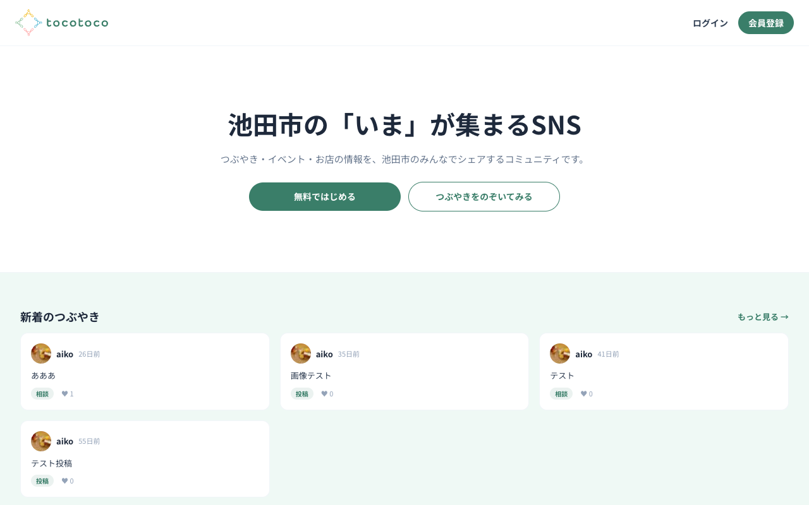
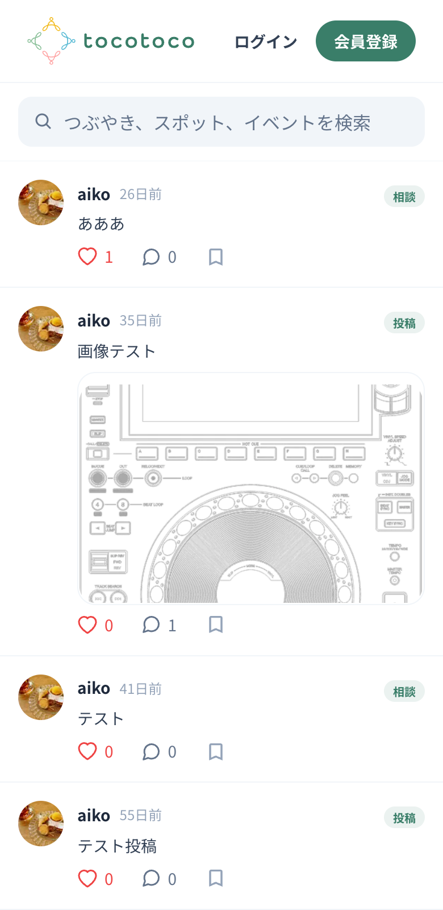
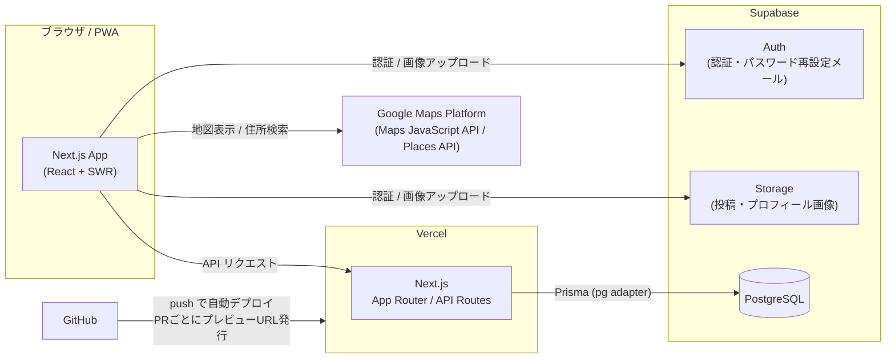

# tocotoco（トコトコ）

**大阪府池田市の「いま」が集まる地域SNS**

つぶやき・スポット・イベントの情報を地域のみんなでシェアするコミュニティサービスです。
「投稿 → いいね・コメント・お気に入り → 通知」というSNSの基本サイクルに加え、Google Maps連携のスポット口コミ、カレンダー形式のイベント情報を1つのアプリにまとめました。スマホでの利用を想定したモバイルアプリ風のUI設計と、PWA対応（ホーム画面へのインストール）がこだわりです。

### 🔗 本番URL

**https://tocotoco-ikeda.vercel.app**

※ 会員登録なしでも、つぶやき・スポット・イベントの閲覧が可能です

| トップページ（PC） | フィード（スマホ） |
| :---: | :---: |
|  |  |

## サービス概要・背景

地域のお店やイベント、日々のできごとの情報は、個人のSNSや口コミに分散していて「地元の情報だけをまとめて見られる場所」がありません。tocotocoは、池田市に住む人・訪れる人が地域の情報を投稿・発見できる場をつくることを目的に開発しました。

## 使用技術

| カテゴリ | 技術 | バージョン |
| --- | --- | --- |
| フロントエンド | Next.js（App Router） | 16.2 |
| | React | 19.2 |
| | TypeScript | 5 |
| | Tailwind CSS | 4 |
| データ取得 | SWR | 2.4 |
| フォーム | React Hook Form + Zod | 7.76 / 4.4 |
| ORM | Prisma（driver adapter: pg） | 7.8 |
| BaaS | Supabase（Auth / Storage / PostgreSQL） | - |
| 地図 | Google Maps Platform（Maps JavaScript API / Places API）+ @vis.gl/react-google-maps | 1.9 |
| ホスティング | Vercel | - |
| その他 | react-calendar / react-modal / ESLint / Prettier | - |

## インフラ構成図

- **CI/CD**: GitHubのmainブランチへのマージで本番へ自動デプロイ。PR作成時はプレビューURLが自動発行され、レビュー時に実際の動作を確認できます
- **APIキー保護**: Google Maps APIキーはHTTPリファラー制限＋API種別制限（Maps JavaScript API / Places APIのみ）を設定。Cloud Billingの予算アラートで課金を監視しています

## 機能一覧

### 認証
- 会員登録（確認メール送信）・ログイン・ログアウト
- パスワード再設定（メールのリンクから再設定）

### つぶやき（投稿）
- 投稿（画像付き）・一覧・詳細
- コメント
- いいね・お気に入り（ブックマーク）

### スポット
- Google Maps上でのスポット一覧表示
- スポット登録（Places APIの住所・場所名オートコンプリート検索、画像4枚まで）
- 口コミ投稿・5段階評価
- お気に入り

### イベント
- カレンダー表示（月送りで該当月のイベントを取得、開催日にドット表示）
- 直近イベントのリスト表示・登録・詳細
- お気に入り

### 検索
- つぶやき・スポット・イベントの横断キーワード検索
- 無限スクロール（useSWRInfinite + IntersectionObserver）

### マイページ
- プロフィール表示・編集（アイコン画像アップロード）
- 自分の投稿一覧・お気に入り一覧

### 通知
- いいね・コメント・お気に入り時に通知を作成
- 通知一覧・既読処理・ヘッダーの未読バッジ

### その他
- **PWA対応**: ホーム画面にインストールするとスタンドアロンのアプリとして起動
- **未ログイン閲覧**: 一覧・詳細は登録なしで閲覧可能（投稿・いいね等はログイン後）
- **レスポンシブ**: トップページはPC向けレイアウト、アプリ画面はモバイルファースト

## 設計のこだわり

- **モバイルアプリ風のレイアウト設計**: Next.jsのルートグループを使い、「一覧＝固定ヘッダー＋下部タブナビ」「詳細＝戻るボタン＋下部タブナビ」「作成フォーム＝没入型（ナビ非表示）」の3パターンにレイアウトを分離
- **公開/認証つきデータ取得の整理**: SWRの共通フックに `requireAuth` オプションを持たせ、公開GETと認証付きリクエストを呼び出し側で明示
- **セキュリティ**: 通知の既読APIは所有者条件つきの更新でIDOR（他人のリソース操作）を防止

## 今後の課題

- 自動テストの導入（コンポーネントテスト・E2E）
- Service Worker + Web Pushによるプッシュ通知
- 一覧APIのページネーション（`limit` パラメータ）によるオーバーフェッチング解消
- 利用規約の整備
